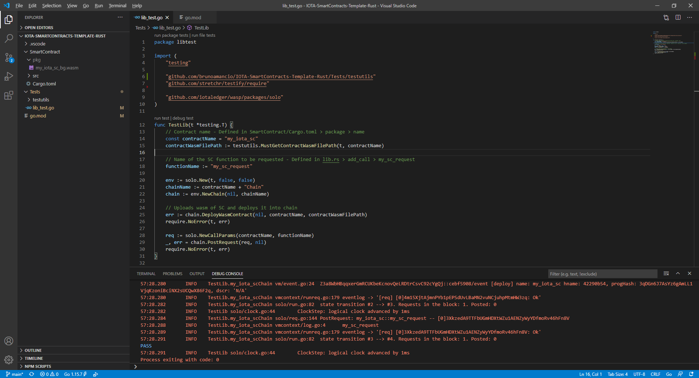
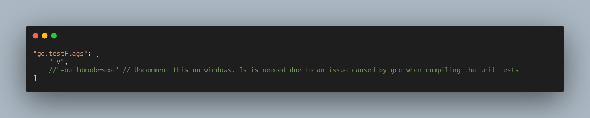

## IOTA smart contracts - Template used to develop in any supported language

A simple template used to start developing your own smart contracts for ISCP (IOTA Smart Contract Protocol) in Rust and write unit tests in Go. In order to develop using the environment set up by this template, you need to have good understanding of the Rust and Go languages.

This is a repository for myself but I welcome anyone interested in playing around with the current state of development of the IOTA Smart Contract Protocol (ISCP). Feel free to contact me on IOTA Foundation's discord server under Th3B0Y#8380.

### Simple structure prepared to start with development right away
This is how the templated file structure looks like:



---

### Requirements for Go and Rust development
- [Go](https://golang.org/dl/) - [Why Go?](general-docs/WhyGo.md)
- Gcc (or equivalent for Windows [(TDM-GCC)](https://jmeubank.github.io/tdm-gcc/)) - [Why Gcc?](general-docs/WhyGo.md)
- [Visual Studio Code](https://code.visualstudio.com/Download) (VSCode)
  - [Go Extension](https://marketplace.visualstudio.com/items?itemName=golang.Go)

### Extra requirements for development in Rust
- [Rust](https://www.rust-lang.org/tools/install)
- [Wasm-pack](https://rustwasm.github.io/wasm-pack/installer/)
- [Visual Studio Code](https://code.visualstudio.com/Download) (VSCode)
  - [Rust extension](https://marketplace.visualstudio.com/items?itemName=rust-lang.rust)
  - [Better TOML](https://marketplace.visualstudio.com/items?itemName=bungcip.better-toml) *Optional nice to have 

### Set code up!
- Use this template repository to create your own.
- Open VSCode and a terminal in it (In the menu : Terminal > New Terminal)
- In the terminal, clone your git repository and enter it with:
```
git clone <your_git_repository>
cd <your_clones_directory>
```
- Initialize the submodule for the language you want to develop in, with `git submodule update --init --recursive -- smartcontract/<language>` and replace `<language>` for `rust` or `go` (go is not available yet). Example for development in Rust:
```
git submodule update --init --recursive -- smartcontract/rust
```
- Open your git repository on VSCode
- For Windows *only*, open file ".vscode/settings.json" and uncomment the setting "go.testFlags" entry "-buildmode=exe":

- Open file `go.mod` and change the go module's name from `module github.com/brunoamancio/IOTA-SmartContracts-Template-Base` to `module github.com/<your_username>/<your_project_name>`

*Done!* Now you can write your smart contract in `smartcontract/<language>`, [compile](general-docs/Compile-SmartContract.md) it, [run and debug](general-docs/UnitTest-and-debug-SmartContract.md) unit tests in `tests/smartcontract/my_iota_smart_contract_test.go`!

---
[MIT License](LICENSE)
