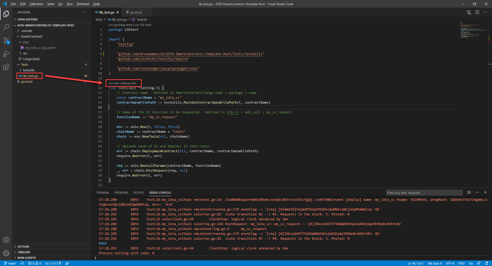

### Run and debug a smart contract's unit tests

With the development environment set-up, it is a matter of opening the test files and clicking on "run test" or "debug test" on a unit test, like so:

